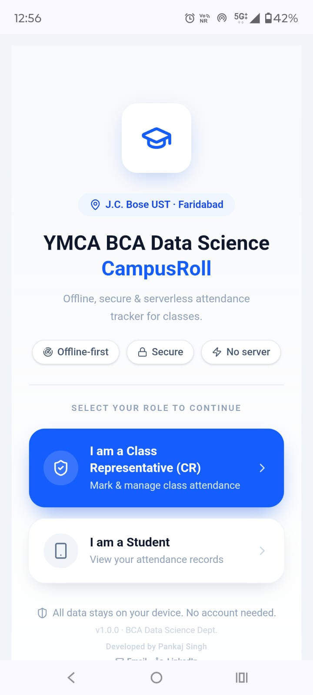
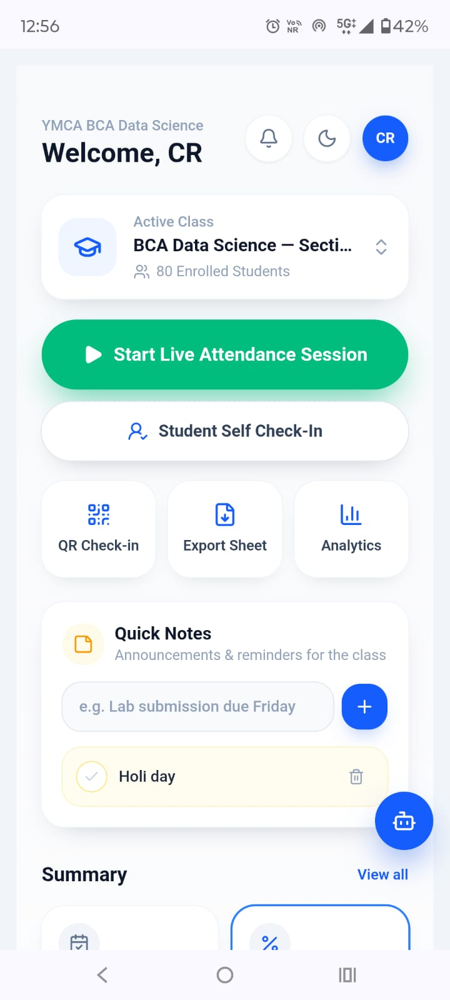
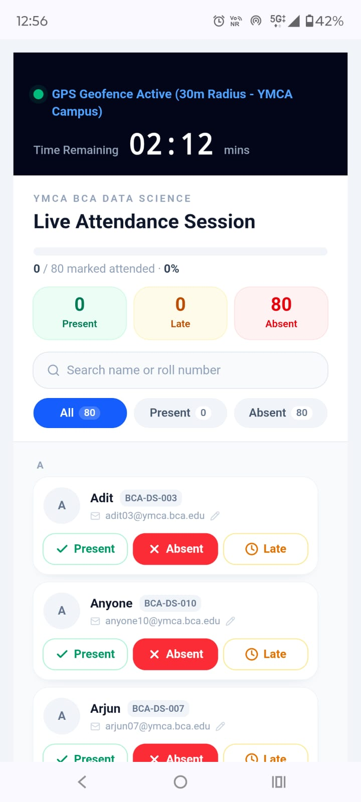
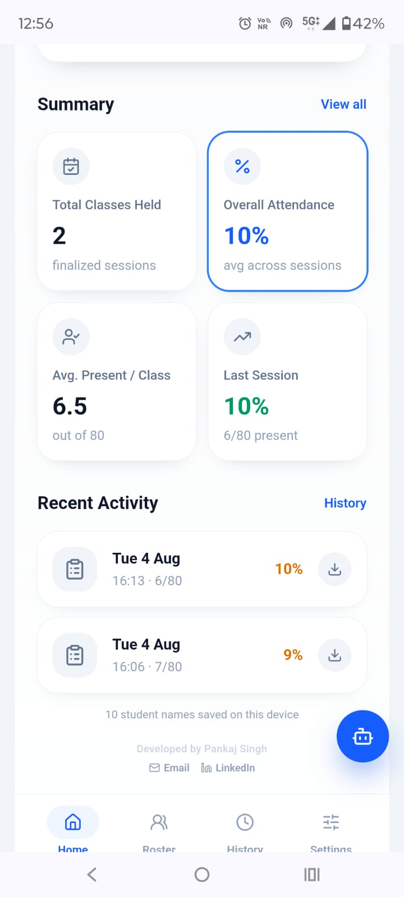

# CampusRoll — Attendance Management System

CampusRoll is an offline-first attendance management application for classroom coordinators and students. It supports secure QR-based check-in, location verification, attendance history, analytics, and report export without requiring a dedicated backend.

## Features

- Create and manage live attendance sessions
- QR code check-in with short-lived session tokens
- Location-aware check-in and single-device safeguards
- Attendance history, analytics, and status updates- Export attendance data as CSV, Docx, Excel, and PDF
- Offline browser storage for roster, sessions, and notes
- Built-in help panel for common check-in and export questions

## Technology Stack

- React and TypeScript
- TanStack Start and TanStack Router
- Vite and Tailwind CSS
- Radix UI
- jsPDF, SheetJS, QRCode, and jsQR

## Screenshots

| Welcome screen | Coordinator dashboard |
| --- | --- |
|  |  |

| Live attendance session | Attendance analytics |
| --- | --- |
|  |  |

## Getting Started

### Prerequisites

- Node.js 20 or later
- npm 10 or later

### Installation

```bash
git clone https://github.com/<your-username>/campusroll-attendance-management.git
cd campusroll-attendance-management
npm install
npm run dev
```

Open the local address shown in your terminal (normally `http://localhost:3000`).

## Available Scripts

| Command | Description |
| --- | --- |
| `npm run dev` | Starts the local development server. |
| `npm run build` | Creates a production build. |
| `npm run preview` | Previews the production build locally. |
| `npm run lint` | Runs ESLint. |
| `npm run format` | Formats source files with Prettier. |

## Data and Privacy

CampusRoll stores application data in the browser on the current device. For a production deployment, add authentication, server-side storage, and an appropriate privacy policy before collecting real student data.

## Author

Pankaj Singh · [LinkedIn](https://www.linkedin.com/in/pankaj-singh-053a2a364)
